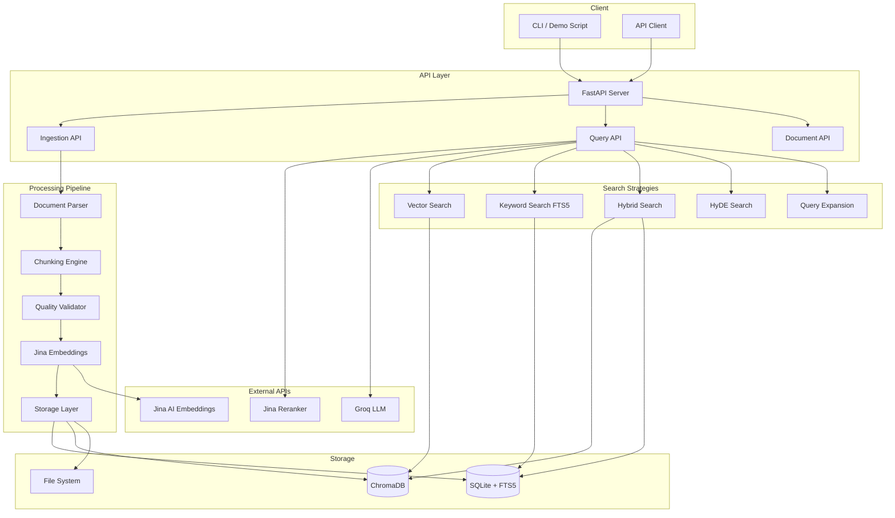

# Ragwell

A production-ready Retrieval-Augmented Generation (RAG) pipeline with multiple search strategies, semantic chunking, and real-time document processing. Built with FastAPI, ChromaDB, and Jina AI embeddings.

[](https://www.python.org/downloads/)
[](https://fastapi.tiangolo.com/)
[](https://opensource.org/licenses/MIT)

---

## Overview

Ragwell is a backend API service that makes it easy to ingest documents, generate embeddings, and run semantic search across your data. It supports five search strategies — from fast keyword matching to LLM-powered hypothetical document expansion — and is built for production use with rate limiting, exponential backoff, and connection pooling out of the box.

---

## Architecture



---

## Features

- **Multi-format document ingestion** — PDF, DOCX, TXT, CSV, HTML
- **5 search strategies** — Vector, Keyword (FTS5), Hybrid, HyDE, and Query Expansion
- **Jina AI integration** — Asymmetric embeddings (query vs. passage) and reranking
- **Semantic chunking** — Recursive and semantic chunking with quality validation
- **Background processing** — Async document ingestion with real-time status tracking
- **Production-ready** — Rate limiting, exponential backoff, and connection pooling

---

## Tech Stack

| Category | Technology |
|---|---|
| Backend | FastAPI, Uvicorn, Python 3.11+ |
| Vector DB | ChromaDB |
| Relational DB | SQLite with FTS5 |
| Embeddings | Jina AI Embeddings v3 |
| Reranking | Jina Reranker v2 |
| LLM | Groq (Llama 3) |
| Chunking | LangChain Text Splitters |

---

## Performance

| Search Strategy | Latency |
|---|---|
| Keyword (FTS5) | < 15ms |
| Vector | ~650ms |
| Hybrid | ~680ms |
| HyDE | ~2.4s |
| Query Expansion | ~3.4s |

Other metrics: document processing ~5s/MB, max relevance score 0.93, 100% data consistency between SQLite and ChromaDB.

---

## Quick Start

### Prerequisites

- Python 3.11+
- [Jina AI API key](https://jina.ai/embeddings/) — free tier includes 10M tokens
- [Groq API key](https://console.groq.com/) — free tier available

### Installation

```bash
git clone https://github.com/Emart29/ragwell.git
cd ragwell

python -m venv venv
source venv/bin/activate  # Windows: venv\Scripts\activate

pip install -r requirements.txt

mkdir -p data/uploads data/chroma

cp .env.example .env
```

### Configuration

Edit `.env` with your API keys:

```env
JINA_API_KEY=jina_xxxxxxxxxxxx   # Required — embeddings and reranking
GROQ_API_KEY=gsk_xxxxxxxxxxxx    # Required — HyDE and query expansion
# GEMINI_API_KEY=your_key_here   # Optional — alternative LLM
```

### Start the server

```bash
python -m uvicorn app.main:app --port 8000
```

The API will be running at `http://localhost:8000`. Interactive docs are available at `http://localhost:8000/docs`.

### Run the demo

```bash
python scripts/demo.py
```

This generates sample documents, uploads and processes them, runs queries across all five search strategies, and prints evaluation metrics.

---

## API Reference

Base URL: `http://localhost:8000/api`

### Health check

```http
GET /api/health
```

```json
{
  "status": "healthy",
  "total_documents": 10,
  "total_chunks": 150,
  "chromadb_collection_count": 150
}
```

### Upload a document

```http
POST /api/ingest
Content-Type: multipart/form-data
```

| Parameter | Type | Default | Description |
|---|---|---|---|
| `file` | file | — | Document to upload (PDF, DOCX, TXT, CSV, HTML) |
| `chunk_strategy` | string | `recursive` | `recursive` or `semantic` |
| `chunk_size` | int | `512` | Characters per chunk (128–1024) |
| `chunk_overlap` | int | `50` | Overlap between chunks (0–200) |

```json
{
  "document_id": "uuid",
  "status": "processing",
  "filename": "document.pdf"
}
```

### Query documents

```http
POST /api/query
Content-Type: application/json
```

```json
{
  "query": "What is machine learning?",
  "strategy": "hybrid",
  "top_k": 10,
  "rerank": true,
  "alpha": 0.7
}
```

`alpha` controls the vector/keyword balance in hybrid search (0 = keyword only, 1 = vector only).

```json
{
  "results": [
    {
      "chunk_id": "uuid",
      "text": "Machine learning is...",
      "score": 0.85,
      "document": {
        "id": "uuid",
        "filename": "ml_guide.pdf"
      }
    }
  ],
  "strategy": "hybrid",
  "search_time_ms": 650.5,
  "total_candidates": 20
}
```

### List documents

```http
GET /api/documents?page=1&per_page=20
```

### Get document chunks

```http
GET /api/documents/{document_id}/chunks
```

### Delete a document

```http
DELETE /api/documents/{document_id}
```

---

## Search Strategies

| Strategy | How it works | Best for |
|---|---|---|
| `keyword` | SQLite FTS5 full-text search | Exact term matching, fast lookups |
| `vector` | Semantic similarity via ChromaDB | Conceptual or paraphrased queries |
| `hybrid` | Weighted fusion of vector + keyword | General-purpose (recommended default) |
| `hyde` | Generates a hypothetical answer, embeds it, searches | Complex or abstract questions |
| `expanded` | LLM rewrites the query into multiple variants, searches all | Broad topic exploration |

---

## Project Structure

```
ragwell/
├── app/
│   ├── api/
│   │   ├── ingest.py          # Document upload endpoints
│   │   ├── query.py           # Search endpoints
│   │   └── documents.py       # Document management endpoints
│   ├── embeddings/
│   │   └── embedder.py        # Jina AI embedding integration
│   ├── retrieval/
│   │   ├── vector_search.py   # ChromaDB vector search
│   │   ├── keyword_search.py  # FTS5 keyword search
│   │   ├── hybrid_search.py   # Combined search with score fusion
│   │   ├── reranker.py        # Jina Reranker integration
│   │   └── query_expand.py    # HyDE and query expansion
│   ├── storage/
│   │   ├── database.py        # SQLite connection management
│   │   ├── models.py          # ORM models
│   │   └── vector_store.py    # ChromaDB wrapper
│   ├── parsing/               # Document parsers (PDF, DOCX, etc.)
│   ├── chunking/              # Text chunking strategies
│   ├── validation/            # Chunk quality validation
│   ├── llm/                   # LLM provider abstractions
│   └── main.py                # FastAPI app entry point
├── scripts/
│   └── demo.py                # End-to-end demo script
├── evaluation/                # Evaluation and benchmarking tools
├── tests/
├── data/                      # Runtime data (uploads, ChromaDB)
├── requirements.txt
└── .env.example
```

---

## Testing

```bash
# Fast unit tests — no API keys required (~25s)
python -m pytest tests/test_parsers.py tests/test_cache.py tests/test_quality.py -v

# With coverage report
python -m pytest tests/test_parsers.py tests/test_cache.py tests/test_quality.py --cov=app --cov-report=html

# Full test suite including API integration tests (~5 min, requires API keys)
python -m pytest tests/ -v --timeout=60
```

| Suite | Tests | Time | Requires API keys |
|---|---|---|---|
| Parsers | 30 | ~6s | No |
| Cache | 10 | ~1s | No |
| Quality | 7 | ~1s | No |
| API Integration | 17 | ~5min | Yes (Jina + Groq) |

The fast unit tests are recommended for CI/CD pipelines.

---

## Deployment

### Docker

```dockerfile
FROM python:3.11-slim

WORKDIR /app
COPY requirements.txt .
RUN pip install --no-cache-dir -r requirements.txt

COPY . .

EXPOSE 8000
CMD ["uvicorn", "app.main:app", "--host", "0.0.0.0", "--port", "8000"]
```

```bash
docker build -t ragwell .
docker run -p 8000:8000 --env-file .env ragwell
```

### Docker Compose

```yaml
version: '3.8'
services:
  ragwell:
    build: .
    ports:
      - "8000:8000"
    env_file:
      - .env
    volumes:
      - ./data:/app/data
```

### Scaling notes

When moving beyond a single instance, a few things to consider:

- **Database**: Replace SQLite with PostgreSQL (supports concurrent writes and multiple instances).
- **Vector store**: For large datasets (millions of chunks), consider a dedicated vector DB like Pinecone or Weaviate instead of ChromaDB.
- **Caching**: Add Redis to cache frequent query results and reduce embedding API calls.
- **Job queue**: Use Celery + Redis to manage document processing jobs across workers.

---

## Contributing

1. Fork the repository
2. Create a feature branch: `git checkout -b feature/your-feature`
3. Commit your changes: `git commit -m 'Add your feature'`
4. Push to the branch: `git push origin feature/your-feature`
5. Open a Pull Request

---

## License

This project is licensed under the MIT License — see [LICENSE](LICENSE) for details.

---

## Acknowledgements

- [Jina AI](https://jina.ai) for embeddings and reranking APIs
- [Groq](https://groq.com) for fast LLM inference
- [ChromaDB](https://www.trychroma.com) for vector storage
- [FastAPI](https://fastapi.tiangolo.com) for the API framework