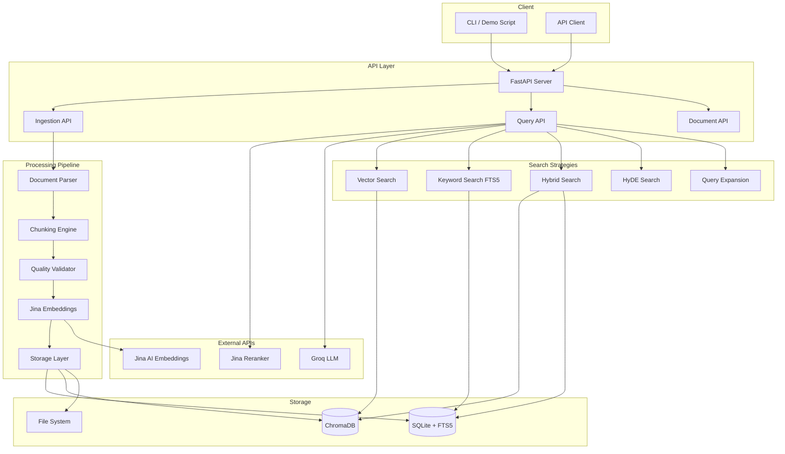

# Ragwell

A Retrieval-Augmented Generation pipeline with five search strategies, semantic chunking, and **citations that are verified rather than emitted** — every claim carries the chunk it came from and the words that support it, checked by string containment before you see it.

Built with FastAPI, ChromaDB and Jina AI embeddings, and benchmarked against long context on four regulatory annual reports.

[](https://www.python.org/downloads/)
[](https://fastapi.tiangolo.com/)
[](https://opensource.org/licenses/MIT)

---

## Overview

Ragwell is a backend API service that makes it easy to ingest documents, generate embeddings, and run semantic search across your data. It supports five search strategies — from fast keyword matching to LLM-powered hypothetical document expansion — and is built for production use with rate limiting, exponential backoff, and connection pooling out of the box.

---

## Citations you can check

Ragwell retrieves. This layer answers, and every claim it makes carries the
chunk it came from and the words that support it — checked, not merely emitted.

```
VERIFIED  The deposit insurance limit for microfinance bank depositors was
          increased from N200,000 to N2,000,000 per depositor per MFB.
          2024-Annual-Report.pdf, p.27
          quote: "At the same time, the limit for MFBs was increased from
                  N200,000 to N2,000,000 per depositor per MFB"
```

Two things make that answer harder than it looks. Three of the four reports in
the corpus state the **superseded** N200,000 limit, and state it as plainly as
the current report states the new one. And the quote is verified by string
containment against the cited chunk — no second model needed to check it.

### What was measured

Four Nigeria Deposit Insurance Corporation annual reports (2020–2024), sixteen
hand-labelled questions, both arms on `gemini-3.5-flash-lite`, 29 August 2026.
Raw results are committed as `benchmark_results.json`, `chunking_results.json`
and `calibration_results.json`.

**Retrieval costs a flat rate; long context scales with the corpus.**

| corpus | retrieval | long context | tokens/question, retrieval | tokens/question, long context |
|---|---|---|---|---|
| 1 report | 100% | 100% | 2,654 | 59,544 |
| 2 reports | 88% | 50% | 2,563 | 115,621 |
| 3 reports | 75% | 86% | 2,557 | 181,981 |
| 4 reports | 88% | 62% | 2,529 | 319,771 |

At four reports long context costs **126×** more per question for the same
question. Retrieval's cost does not move as the corpus grows; that is the whole
point of retrieval and it is the one result here that is arithmetic rather than
sampling.

**Read the accuracy column with its n.** Ten questions per cell means one
question is ten points, so a gap that size is noise. The accuracy comparison is
inconclusive at this sample size and is reported as such.

**Long context does not solve superseded documents.** This is the result that
surprised me. Seeing all four reports at once ought to let a model resolve a
contradiction that retrieval, seeing a slice, cannot. It does not: long context
stated a superseded figure on **67%** of the misleading questions at two of the
four corpus sizes, against retrieval's 33%. An earlier, incomplete run suggested
the opposite and I nearly published it.

**Smaller chunks buy citation precision for free.**

| chunk size | correct | tokens a reader must check |
|---|---|---|
| 128 | 75% | 103 |
| 256 | 75% | 193 |
| 512 | 88% | 401 |
| 1024 | 75% | 819 |

A citation at 1024 tokens asks the reader to check **7.9×** the text of one at
128, and accuracy is flat across the sweep within one question.

**The confidence score is not a probability.** Expected calibration error 15.1%
over 45 outcomes. It is well behaved at the top (+5% in both high bins) and badly
*under*confident at the bottom: answers scored 0.4–0.6 were right every time. No
threshold pays for itself — the best available reaches 93% accuracy by declining
19 of 33 answers to avoid roughly 2 wrong ones. So the fallback threshold is left
unset, on the evidence, and the curve is published instead of a number.

### Using it

```bash
python eval/fetch_corpus.py          # download the corpus (~450MB, checksummed)
python scripts/run_benchmark.py      # the matrix, both arms, four corpus sizes
python scripts/run_chunking_sweep.py # chunk size against citation precision
python scripts/run_calibration.py    # confidence against measured accuracy
python scripts/build_report.py       # one self-contained HTML file
```

Ask a question and see the evidence:

```bash
python scripts/ask.py "What is the maximum deposit insurance coverage?" --judge
```

Or over HTTP:

```bash
curl -X POST localhost:8000/api/answer \
  -H "Content-Type: application/json" \
  -d '{"question": "...", "chunks_shown": 5}'
```

`top_k` is the candidate pool the search returns; **`chunks_shown` is what
reaches the model** after reranking. They are named separately because conflating
them overstates the context by a third, which the earlier metadata in this repo
did.

### How a citation is checked

Three rungs, in increasing cost, each reported separately so the cheap ones can
be counted alone:

1. **Quote containment** — is the quote really in the cited chunk? Free,
   deterministic, and whitespace-normalised because models reflow it when quoting.
2. **Lexical overlap** — do the claim's content words appear in the chunk?
   Catches a genuine quote supporting an overreaching claim.
3. **Entailment** — does the chunk support the claim? One model call, and the
   only rung that costs anything.

The entailment judge is a model judging a model, so its agreement with hand
labels is measured before any number it produces is quoted: **8 of 8** on the
labelled set, zero false supports, stable across three runs. Eight cases is small
and is quoted that way.

### Honest limits

- **Provider-, model- and date-specific.** Measured on 29 August 2026. Two models
  used earlier in this work were withdrawn by their provider mid-benchmark.
- **Ten questions per cell.** Strong enough for the cost and trap findings, not
  for accuracy differences.
- **The corpus is one regulator's annual reports.** Dense, numeric, and English.
  A corpus of prose would behave differently.
- **The scripts reset the index.** Each measurement script clears the store and
  re-ingests at the size it needs, so run one and the demo corpus is gone until
  you re-ingest.
- **ChromaDB does not see another process's writes.** Ingest, then restart the
  server, or it will answer from a stale view.

---

## Architecture



---

## Features

- **Multi-format document ingestion** — PDF, DOCX, TXT, CSV, HTML
- **5 search strategies** — Vector, Keyword (FTS5), Hybrid, HyDE, and Query Expansion
- **Jina AI integration** — Asymmetric embeddings (query vs. passage) and reranking
- **Semantic chunking** — Recursive and semantic chunking with quality validation
- **Background processing** — Async document ingestion with real-time status tracking
- **Production-ready** — Rate limiting, exponential backoff, and connection pooling
- **Verified citations** — every claim cites a chunk and quotes it verbatim, checked three ways
- **Declines when it should** — "the corpus does not support an answer" is a first-class response, not an error
- **Benchmarked against long context** — retrieval versus stuffing the whole corpus, measured on cost and on correctness

---

## Tech Stack

| Category | Technology |
|---|---|
| Backend | FastAPI, Uvicorn, Python 3.11+ |
| Vector DB | ChromaDB |
| Relational DB | SQLite with FTS5 |
| Embeddings | Jina AI Embeddings v3 |
| Reranking | Jina Reranker v2 |
| LLM | Groq and Google Gemini, named explicitly and never substituted |
| Chunking | LangChain Text Splitters |

---

## Performance

| Search Strategy | Latency |
|---|---|
| Keyword (FTS5) | < 15ms |
| Vector | ~650ms |
| Hybrid | ~680ms |
| HyDE | ~2.4s |
| Query Expansion | ~3.4s |

Other metrics: document processing ~5s/MB, max relevance score 0.93, 100% data consistency between SQLite and ChromaDB.

---

## Quick Start

### Prerequisites

- Python 3.11+
- [Jina AI API key](https://jina.ai/embeddings/) — free tier includes 10M tokens
- [Groq API key](https://console.groq.com/) — free tier available

### Installation

```bash
git clone https://github.com/Emart29/ragwell.git
cd ragwell

python -m venv venv
source venv/bin/activate  # Windows: venv\Scripts\activate

pip install -r requirements.txt

mkdir -p data/uploads data/chroma

cp .env.example .env
```

### Configuration

Edit `.env` with your API keys:

```env
JINA_API_KEY=jina_xxxxxxxxxxxx   # Required — embeddings and reranking
GROQ_API_KEY=gsk_xxxxxxxxxxxx    # Required — HyDE and query expansion
# GEMINI_API_KEY=your_key_here   # Optional — alternative LLM
```

### Start the server

```bash
python -m uvicorn app.main:app --port 8000
```

The API will be running at `http://localhost:8000`. Interactive docs are available at `http://localhost:8000/docs`.

### Run the demo

```bash
python scripts/demo.py
```

This generates sample documents, uploads and processes them, runs queries across all five search strategies, and prints evaluation metrics.

---

## API Reference

Base URL: `http://localhost:8000/api`

### Health check

```http
GET /api/health
```

```json
{
  "status": "healthy",
  "total_documents": 10,
  "total_chunks": 150,
  "chromadb_collection_count": 150
}
```

### Upload a document

```http
POST /api/ingest
Content-Type: multipart/form-data
```

| Parameter | Type | Default | Description |
|---|---|---|---|
| `file` | file | — | Document to upload (PDF, DOCX, TXT, CSV, HTML) |
| `chunk_strategy` | string | `recursive` | `recursive` or `semantic` |
| `chunk_size` | int | `512` | Characters per chunk (128–1024) |
| `chunk_overlap` | int | `50` | Overlap between chunks (0–200) |

```json
{
  "document_id": "uuid",
  "status": "processing",
  "filename": "document.pdf"
}
```

### Query documents

```http
POST /api/query
Content-Type: application/json
```

```json
{
  "query": "What is machine learning?",
  "strategy": "hybrid",
  "top_k": 10,
  "rerank": true,
  "alpha": 0.7
}
```

`alpha` controls the vector/keyword balance in hybrid search (0 = keyword only, 1 = vector only).

```json
{
  "results": [
    {
      "chunk_id": "uuid",
      "text": "Machine learning is...",
      "score": 0.85,
      "document": {
        "id": "uuid",
        "filename": "ml_guide.pdf"
      }
    }
  ],
  "strategy": "hybrid",
  "search_time_ms": 650.5,
  "total_candidates": 20
}
```

### List documents

```http
GET /api/documents?page=1&per_page=20
```

### Get document chunks

```http
GET /api/documents/{document_id}/chunks
```

### Delete a document

```http
DELETE /api/documents/{document_id}
```

---

## Search Strategies

| Strategy | How it works | Best for |
|---|---|---|
| `keyword` | SQLite FTS5 full-text search | Exact term matching, fast lookups |
| `vector` | Semantic similarity via ChromaDB | Conceptual or paraphrased queries |
| `hybrid` | Weighted fusion of vector + keyword | General-purpose (recommended default) |
| `hyde` | Generates a hypothetical answer, embeds it, searches | Complex or abstract questions |
| `expanded` | LLM rewrites the query into multiple variants, searches all | Broad topic exploration |

---

## Project Structure

```
ragwell/
├── app/
│   ├── api/
│   │   ├── ingest.py          # Document upload endpoints
│   │   ├── query.py           # Search endpoints
│   │   └── documents.py       # Document management endpoints
│   ├── embeddings/
│   │   └── embedder.py        # Jina AI embedding integration
│   ├── retrieval/
│   │   ├── vector_search.py   # ChromaDB vector search
│   │   ├── keyword_search.py  # FTS5 keyword search
│   │   ├── hybrid_search.py   # Combined search with score fusion
│   │   ├── reranker.py        # Jina Reranker integration
│   │   └── query_expand.py    # HyDE and query expansion
│   ├── storage/
│   │   ├── database.py        # SQLite connection management
│   │   ├── models.py          # ORM models
│   │   └── vector_store.py    # ChromaDB wrapper
│   ├── parsing/               # Document parsers (PDF, DOCX, etc.)
│   ├── chunking/              # Text chunking strategies
│   ├── validation/            # Chunk quality validation
│   ├── llm/                   # LLM provider abstractions
│   └── main.py                # FastAPI app entry point
├── scripts/
│   └── demo.py                # End-to-end demo script
├── evaluation/                # Evaluation and benchmarking tools
├── tests/
├── data/                      # Runtime data (uploads, ChromaDB)
├── requirements.txt
└── .env.example
```

---

## Testing

```bash
# Fast unit tests — no API keys required (~25s)
python -m pytest tests/test_parsers.py tests/test_cache.py tests/test_quality.py -v

# With coverage report
python -m pytest tests/test_parsers.py tests/test_cache.py tests/test_quality.py --cov=app --cov-report=html

# Full test suite including API integration tests (~5 min, requires API keys)
python -m pytest tests/ -v --timeout=60
```

| Suite | Tests | Time | Requires API keys |
|---|---|---|---|
| Parsers | 30 | ~6s | No |
| Cache | 10 | ~1s | No |
| Quality | 7 | ~1s | No |
| API Integration | 17 | ~5min | Yes (Jina + Groq) |

The fast unit tests are recommended for CI/CD pipelines.

---

## Deployment

### Docker

```dockerfile
FROM python:3.11-slim

WORKDIR /app
COPY requirements.txt .
RUN pip install --no-cache-dir -r requirements.txt

COPY . .

EXPOSE 8000
CMD ["uvicorn", "app.main:app", "--host", "0.0.0.0", "--port", "8000"]
```

```bash
docker build -t ragwell .
docker run -p 8000:8000 --env-file .env ragwell
```

### Docker Compose

```yaml
version: '3.8'
services:
  ragwell:
    build: .
    ports:
      - "8000:8000"
    env_file:
      - .env
    volumes:
      - ./data:/app/data
```

### Scaling notes

When moving beyond a single instance, a few things to consider:

- **Database**: Replace SQLite with PostgreSQL (supports concurrent writes and multiple instances).
- **Vector store**: For large datasets (millions of chunks), consider a dedicated vector DB like Pinecone or Weaviate instead of ChromaDB.
- **Caching**: Add Redis to cache frequent query results and reduce embedding API calls.
- **Job queue**: Use Celery + Redis to manage document processing jobs across workers.

---

## Contributing

1. Fork the repository
2. Create a feature branch: `git checkout -b feature/your-feature`
3. Commit your changes: `git commit -m 'Add your feature'`
4. Push to the branch: `git push origin feature/your-feature`
5. Open a Pull Request

---

## License

This project is licensed under the MIT License — see [LICENSE](LICENSE) for details.

---

## Acknowledgements

- [Jina AI](https://jina.ai) for embeddings and reranking APIs
- [Groq](https://groq.com) for fast LLM inference
- [ChromaDB](https://www.trychroma.com) for vector storage
- [FastAPI](https://fastapi.tiangolo.com) for the API framework